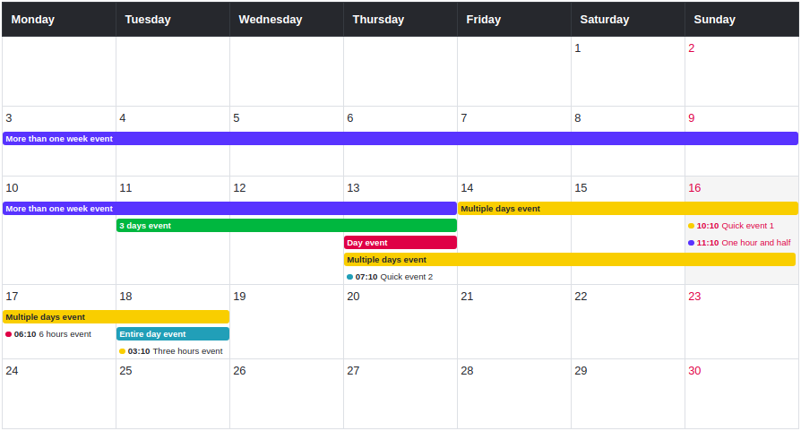

# react-event-calendar [](https://travis-ci.org/lzakrzewski/react-monthly-events) [](https://badge.fury.io/js/react-monthly-events)

## A monthly calendar view component for React
A [Bootstrap 4](https://getbootstrap.com/) based [React](https://reactjs.org/) component to display calendar with scheduled events for given month.



## Features
- Monthly calendar view
- Can display different types of events (events on exact date, time range events)
- Modern styling and layout ([Bootstrap 4](https://getbootstrap.com/))

## Installation 
`npm install react-monthly-events`

## Demo 
Online demo is available!
[https://react-monthly-events.herokuapp.com/](https://react-monthly-events.herokuapp.com/)  

## Working example
You can quickly setup this calendar component on your local machine and see how it works:
[lzakrzewski/react-monthly-events-sandbox](https://github.com/lzakrzewski/react-monthly-events-sandbox)

## Basic usage 
```jsx harmony
import React, { Component } from 'react';
import MonthlyEvents from 'react-monthly-events';

class YourComponent extends Component {
    render() {
        const currentMonth = new Date('2017-01-01');
        const events = [
            { 
                id: 'event-1', 
                start: '2017-01-03 18:00:00', 
                end: '2017-01-03 19:30:00', 
                allDay: false, 
                event: 'Learn ReactJS' 
            },
            { 
                id: 'event-2', 
                start: '2017-01-04 17:01:00',  
                allDay: false, 
                event: 'Go home' 
            },
        ];
        
        return (
            <div className="row">
                <MonthlyEvents
                    currentMonth={ currentMonth }
                    events={ events }
                />
            </div>
        );
    }
}
```

#### Props
- `currentMonth` indicates a month to display. For example if you want to display the calendar page for February 2017 you need to provide any date between "2017-02-01" and "2017-02-28".
It can be string, an instance of moment or an instance of Date.
- `events` is an array of events to display. The component will filter out the all events from not matching months. 

#### Structure of the event objects
| name    | description                                                                                                        | type       | required |
|---------|--------------------------------------------------------------------------------------------------------------------|------------|----------|
| id      | an unique identifier for the event                                                                                 | string     | true     |
| start   | a date when the event starts                                                                                       | ISO string | true     |
| event   | a name of the event                                                                                                | ISO string | true     |
| allDay  | when it is `true` the event will be a "bar" on the top of a cell when it is `false` the event will appear as "dot" | boolean    | true     |
| end     | a date when the event ends                                                                                         | ISO string | false    |

```
{
    id: 'event-1',
    start: '2017-02-01',
    end: '2017-02-02',
    event: 'Learn ReactJS',
    allDay: false
}
```

## Dependencies
- [Bootstrap](https://getbootstrap.com/): "4.x"
- [Moment.js](https://momentjs.com/): "2.x",
- [Lodash](https://lodash.com/): "4.x",
- [React](https://reactjs.org/): "16.x"
    
